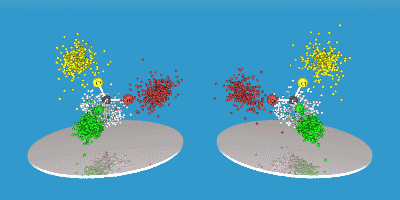

.. AMCESS documentation master file, created by
   sphinx-quickstart on Mon Dec 13 17:36:21 2021.
   You can adapt this file completely to your liking, but it should at least
   contain the root `toctree` directive.

.. raw:: html

   

      <h1 style=font-size:45px align="center"> 
      Electron Chirality Measure 
   </h1>
   

.. toctree::
   :maxdepth: 4
   :caption: Contents:
   :titlesonly:   

   Home <self>
   About <about>
   Basic Example <quickstart>
   ECM API <modules>
   support

ECM
===

The Electronic Chirality Measure (ECM) is a quantity that allows to the measure
the chirality of any (chiral) molecular system. It was proposed by Luca Bellarosa and Francesco
Zerbetto in 2003 :cite:`2003_Bellarosa`.

The Electronic Chirality Measure (ECM) is an end-to-end package implemented in Python 3.9 to 
measure the mentioned quantity. It also has some development interface
with the `PySCF <https://pyscf.org/>`_ and `DIRAC <https://www.diracprogram.org/>`_ packages.

The ecm package uses simple input files in xyz format. The so called nearest
asymmetric structure is also needed. It can be easily obtained from (citar).
The package also allows the user to perform some simple plots to have a 
better understanding on the geometry of the systems under study.

The ECM is calculated computing the electronic wave function using a standard and powerful
quantum chemistry package such as `PySCF <https://pyscf.org/>`_, the 
Python-based Simulations of Chemistry Framework. PySCF is an efficient 
platform for quantum chemistry calculations that can be used to simulate the
properties of molecules and crystals using mean-field and post-mean-field 
methods [1]_. 

The ecm main purpose is to be a user friendly package, easy to install, 
import, and run, available in most platforms and open-source. 
As a Python module, ecm can be integrated into any workflow. This package 
has code reviews with unit testing and continuous integration, code coverage
tools, and automatically keeps documentation up–to–date. 

The basic (:doc:`examples <quickstart>`) demonstrates some of these 
features. Read more on :doc:`Installation <quickstart>`.

These package allows to:

   1. Perform basic plots in order to analyze the systems under study.
   2. Import and export molecules from/to xyz and DIRAC format.
   3. Calculate CCM and ECM in a single structure.
   4. Calculate CCM and ECM in several structures at once and in the virtual mirroring path of each one.

Read more on `ECM publications <https://doi.org/10.1021/ja028646+>`_.

Availability
============

ECM can be easily installed with its dependencies using the pip or conda 
package managers. All source code is available under the GNU General Public 
License, version 3 from `GitLab <https://github.com/juanjoaucar/pyECM>`_
and the `Python Package index <pypi.org/project/pyECM>`_.

Participating
=============

Please report bugs or enhancement requests through the Issue Tracker.

ECM is open source and welcomes your contributions. Fork the repository on 
GitLab and submit a pull request. Participate on the developer Discord Server.

.. rubric:: Footnotes

.. [1] All of the features in PySCF are implemented in Python, while computationally critical parts are implemented and optimized in C. Using this combined Python/C implementation, the package is as efficient as the best existing C or Fortran based quantum chemistry programs.

References
==========
.. bibliography:: ./refs.bib
   :style: unsrt

Indices and tables
==================

* :ref:`genindex`
* :ref:`modindex`
* :ref:`search`

